# Overview

## Proposed Workflow:

A structured RAG-based Mental Wellness Orchestrator. It bridges clinical evidence-based assessments (PHQ-9/GAD-7) with philosophical wisdom using FastAPI, Ollama, and Qdrant. Built with a "Privacy-by-Design" local-first approach.

```mermaid
graph TD
    Start([User Starts Veritas]) --> Welcome{Main Menu}
    
    Welcome -->|Option 1| Chatbot[Free Chatbot]
    Welcome -->|Option 2| InitialQ[Initial Question: How can I help you?]
    
    %% Chatbot Flow
    Chatbot --> ChatSystem[System Prompt + Memory]
    ChatSystem --> ChatRAG[RAG for Philosophical/Biblical Context]
    ChatRAG --> ChatResponse[Response to User]
    ChatResponse --> ChatContinue{Continue Chat?}
    ChatContinue -->|Yes| Chatbot
    ChatContinue -->|No| Welcome
    
    %% Assessment Flow
    InitialQ --> LLMRouter[LLM Analyzes User Need]
    LLMRouter --> PrefQ[Question: Include philosophical/religious wisdom?]
    PrefQ --> StorePrefs[Store Preferences]
    
    StorePrefs --> RouteDecision{LLM Routing}
    RouteDecision -->|Anxiety Detected| GAD7[Masked Conversation: GAD-7]
    RouteDecision -->|Depression Detected| PHQ9[Masked Conversation: PHQ-9]
    RouteDecision -->|General Wellbeing| WHO5[Masked Conversation: WHO-5]
    
    GAD7 --> CollectAnswers[Collect Conversational Answers]
    PHQ9 --> CollectAnswers
    WHO5 --> CollectAnswers
    
    %% Agent Pipeline
    CollectAnswers --> AssessAgent[Assessment Agent]
    
    AssessAgent --> ScoreCalc[Calculate Scores]
    ScoreCalc --> IdentifyConcerns[Identify Primary/Secondary Concerns]
    IdentifyConcerns --> DetermineSeverity[Determine Severity: Mild/Moderate/Severe]
    DetermineSeverity --> SymptomProfile[Generate Structured Symptom Profile]
    
    SymptomProfile --> SafetyAgent{Safety Agent: Crisis Indicators?}
    SafetyAgent -->|Yes - Risk Detected| CrisisAlert[⚠️ Crisis Alert]
    CrisisAlert --> CrisisResources[Show Immediate Resources: Hotlines, Support]
    CrisisResources --> CrisisDisclaimer[Disclaimers + Professional Referral]
    CrisisDisclaimer --> EndCrisis[End Flow - Safety Priority]
    
    SafetyAgent -->|No - Safe to Continue| RecommendAgent[Recommendation Agent]
    
    %% RAG Pipeline
    RecommendAgent --> QueryParse[Query Parsing from Profile]
    QueryParse --> EmbedQuery[Query Embedding]
    
    EmbedQuery --> VectorStores{Vector Stores}
    
    VectorStores --> ClinicalDB[(Vector Store 1: Clinical Evidence)]
    VectorStores --> PracticesDB[(Vector Store 2: Exercises/Practices)]
    VectorStores --> WisdomDB[(Vector Store 3: Philosophy/Bible)]
    
    ClinicalDB --> HybridSearch1[Hybrid Search: BM25 + Semantic Similarity]
    PracticesDB --> HybridSearch2[Hybrid Search: BM25 + Semantic Similarity]
    WisdomDB --> HybridSearch3[Hybrid Search: BM25 + Semantic Similarity]
    
    HybridSearch1 --> CrossEncoder[Cross-Encoder Scoring]
    HybridSearch2 --> CrossEncoder
    HybridSearch3 --> CrossEncoder
    
    CrossEncoder --> Reranking[Reranking by Relevance]
    
    Reranking --> FilterEvidence[Filter by Evidence Quality: RCTs, Meta-analyses]
    FilterEvidence --> MatchSymptoms[Match Exercises → Symptoms + User Capacity]
    MatchSymptoms --> RankedCandidates[Ranked Candidates]
    
    %% Synthesis
    RankedCandidates --> SynthesisAgent[Synthesis Agent]
    SynthesisAgent --> CheckPrefs{Wisdom Preferences?}
    
    CheckPrefs -->|Yes| AddWisdom[Add Philosophical/Biblical Component]
    CheckPrefs -->|No| SkipWisdom[Skip Wisdom]
    
    AddWisdom --> FormatPlan[Format Actionable Plan]
    SkipWisdom --> FormatPlan
    
    FormatPlan --> AddDisclaimers[Add Appropriate Disclaimers]
    AddDisclaimers --> FinalPackage[Personalized Recommendations Package]
    
    %% Response to User
    FinalPackage --> DisplayResults[Display Results to User]
    DisplayResults --> ShowSummary[Show: Visual Summary + Immediate Practice]
    ShowSummary --> ShowPractices[Show: Daily Practices with Evidence]
    ShowPractices --> ShowWisdomOpt[Show: Wisdom/Reflection - if applicable]
    
    ShowWisdomOpt --> UserOptions{User Options}
    
    UserOptions -->|Continue in Chat| PostAssessChat[Contextualized Chat - Assessment Memory]
    UserOptions -->|New Assessment| InitialQ
    UserOptions -->|Main Menu| Welcome
    
    PostAssessChat --> ChatSystem
    
    %% Styling
    classDef agentClass fill:#B8A9D9,stroke:#8B7BA8,stroke-width:3px,color:#000
    classDef vectorClass fill:#A8C5B5,stroke:#789F8F,stroke-width:2px,color:#000
    classDef safetyClass fill:#FFD4C3,stroke:#E89B88,stroke-width:3px,color:#000
    classDef crisisClass fill:#FF6B6B,stroke:#C92A2A,stroke-width:4px,color:#fff
    
    class AssessAgent,RecommendAgent,SynthesisAgent,SafetyAgent agentClass
    class ClinicalDB,PracticesDB,WisdomDB vectorClass
    class SafetyAgent,CrisisAlert,CrisisResources safetyClass
    class EndCrisis crisisClass
```

